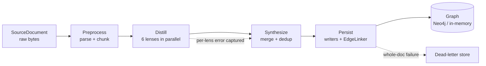
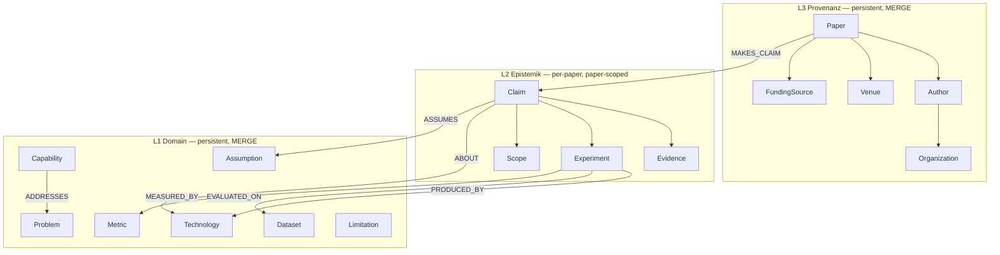

# Architecture — the 10-minute mental model

This is the high-level "what is actually happening here" doc. For the exhaustive
reference see [`PIPELINE.md`](PIPELINE.md); for hand-editing the graph see
[`MANUAL_GRAPH_EDITING.md`](MANUAL_GRAPH_EDITING.md).

---

## 1. In one paragraph

You feed in research papers. The pipeline extracts structured knowledge from
each paper using six LLM-powered "lenses" (each looks for one slice of the
ontology), merges and deduplicates the results, and writes them into a **graph**
whose shape is a fixed **four-layer ontology**. The graph is designed so that
*persistent* concepts (a technology, a research problem, an author) are shared
across all papers, while each paper's *claims and evidence* stay attached to
that paper. A later, separate "assessment" engine (not in this repo) is meant to
read that graph and reason about which claims are actually well-supported.

---

## 2. The pipeline flow

| Stage | Input → Output | Does |
|---|---|---|
| **Preprocess** | `SourceDocument` → `PreprocessedDocument` | format-aware text extraction, NFKC normalize, sliding-window chunking with deterministic ids |
| **Distill** | chunks → `list[LensOutput]` | runs the 6 lenses concurrently (`asyncio.gather`); a lens failure is captured, not fatal |
| **Synthesize** | lens outputs → `Distillate` | merges lens outputs, dedups by canonical name, routes 16 entity types |
| **Persist** | `Distillate` → `(nodes, edges)` | three writers build nodes + structural edges; `EdgeLinker` builds reference-driven edges; repository upserts |

Everything is **ports & adapters**: the pipeline talks to interfaces
(`LLMClient`, `GraphRepository`, `Embedder`, …), and `cli.py` is the *only* place
that picks concrete implementations (fake/anthropic/omlx, in_memory/neo4j). That
is what lets the test suite run the whole thing offline with a `FakeLLMClient`.

---

## 3. The four-layer ontology

The load-bearing idea is **MERGE vs paper-scoped**:

- **L1 Domain** and **L3 Provenanz** nodes are keyed by
  `sha256(tenant || type || canonical_name)`. Two papers that both mention
  "transformer" resolve to the **same** Technology node → knowledge accumulates
  across the corpus.
- **L2 Epistemik** nodes fold `paper_id` into the id, so every paper gets its
  **own** claims/evidence/experiments — they never merge across papers, but
  re-ingesting the *same* paper is idempotent (a MERGE no-op).
- **L4 Assessment** (credence, defeats, …) is deliberately **not** produced here.

### Edge map

| Edge | From → To | Driven by |
|---|---|---|
| `MAKES_CLAIM` | Paper → Claim | structural (writer) |
| `AUTHORED_BY` | Paper → Author | structural (writer) |
| `ABOUT` | Claim → domain entity | claim's `about` field |
| `ASSUMES` | Claim → Assumption | claim's `assumes` field |
| `SUPPORTED_BY` / `REFUTED_BY` | Claim → Evidence | evidence's `claim` + `type` |
| `ADDRESSES` | Capability → Problem | capability's `addresses` |
| `CONCERNS` | Limitation → entity | limitation's `concerns` |
| `HOLDS_UNDER` | Assumption → entity | assumption's `holds_under` |
| `PRODUCED_BY` / `EVALUATED_ON` / `MEASURED_BY` | Experiment → Technology / Dataset / Metric | experiment's list fields |
| `AFFILIATED_WITH` | Author → Organization | author's `affiliation` |
| `CITES` | Paper → Paper | cited-paper mentions |
| `FUNDED_BY` | Paper → FundingSource | funding mentions |

**Reference-driven edges only form when the LLM fills the reference field _and_
the referenced name canonically matches an emitted node.** Any edge whose
endpoints don't resolve is dropped (no dangling edges). This is the single most
important thing to understand about why a graph can look sparse — see §5.

---

## 4. Determinism & idempotency

- Node id `sha256(tenant || type || [paper_id] || canonical(name))[:16]`.
- Chunk id `sha256(document_id || "chunk" || index)[:16]`.
- `document_id` includes the content hash → content change = new version.
- Re-ingesting an unchanged paper is a graph no-op.
- `canonical()` = NFKC + lowercase + whitespace-collapse. (Semantic dedup —
  "ML" ≈ "machine learning" — is explicitly *out of scope*; that's an embedding
  job.)

---

## 5. Quality tooling (how you know it's working)

Because extraction quality depends on a real, swappable LLM, there are two
distinct test layers:

1. **`tests/unit/` — deterministic (fake LLM).** Locks the *code*: id formulas,
   writer MERGE/paper-scoping, edge linking, dangling-edge filtering, Neo4j
   write semantics, dead-lettering. Runs in CI, no model, ~0.1s.
2. **`tests/eval/` — lens quality regression (real LLM).** Runs every lens over
   one fixture paper (`examples/full_ontology_paper.txt`) with a known gold
   standard and scores two things per lens:
   - **entity recall** — did it find the entities?
   - **reference-field coverage** — did it fill the fields that drive the edges?

   It writes a per-model JSON scorecard so you can compare models / prompt
   revisions over time. Skipped unless a real provider is configured.

The **`MANUAL_GRAPH_EDITING.md`** cookbook covers the third reality: when a
local model under-fills reference fields, you patch the missing edges by hand in
Cypher without breaking idempotency.

---

## 6. What was recently fixed (and why it mattered)

Investigating why a real OMLX (`Qwen3.6-35B-A3B-4bit`) ingest produced a sparse,
lopsided graph turned up that **the model wasn't the bottleneck** — entity
recall was already ~0.9. Three concrete defects were:

1. **Lens prompts didn't request the reference fields.** The `about`,
   `addresses`, `concerns`, `holds_under`, experiment `technologies`/`metrics`,
   etc. fields existed in the schemas and were wired to edges — but the prompts
   never asked the model to fill them, so those edge types could never form.
   → **Fix:** every lens prompt now explicitly requests its reference fields
   (using consistent short names so they canonically match).
2. **`ASSUMES` was a cross-product.** The claim writer linked *every* claim to
   *every* assumption in the paper (9 claims × 3 assumptions = 27 false edges).
   → **Fix:** added a `claim.assumes` field; `ASSUMES` is now a reference-driven
   edge in `EdgeLinker`, so a claim links only to the assumptions it names.
3. **The Neo4j adapter dropped `name`.** Nodes were written with only `id` +
   `properties`, so `GraphNode.name` was lost — leaving Limitation/Experiment
   nodes as anonymous husks (blank captions, degraded retrieval).
   → **Fix:** the adapter now persists `name` on every node.

Each shipped with a regression test. The eval harness above was built *first* so
the improvement is measurable:

| Reference field | before (coverage) | after prompts request it |
|---|---|---|
| capability.addresses | 0.00 | ↑ (measured by `tests/eval`) |
| limitation.concerns | 0.00 | ↑ |
| assumption.holds_under | 0.00 | ↑ |
| claim.about | 0.00 | ↑ |
| experiment.metrics | 0.00 | ↑ |

(Entity recall was already strong before the fixes: domain/claim/author/
provenance = 1.00, evidence = 0.83.)

---

## 7. Known seams / out of scope (by design)

- **Cross-document / corpus edges** (`APPLIES_TO`, `UNDERLIES`, corpus-level
  `SUPPORTS`/`CONTRADICTS`) — a separate job over the persisted graph.
- **The Assessment layer** — a downstream engine, not this pipeline.
- **Semantic dedup** — canonical-name matching only; embedding-based merge is a
  separate concern.
- **Small quantized local models** under-fill reference fields even with good
  prompts; that gap is what the eval harness quantifies and the manual patches.
