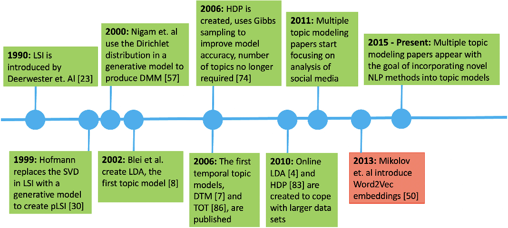
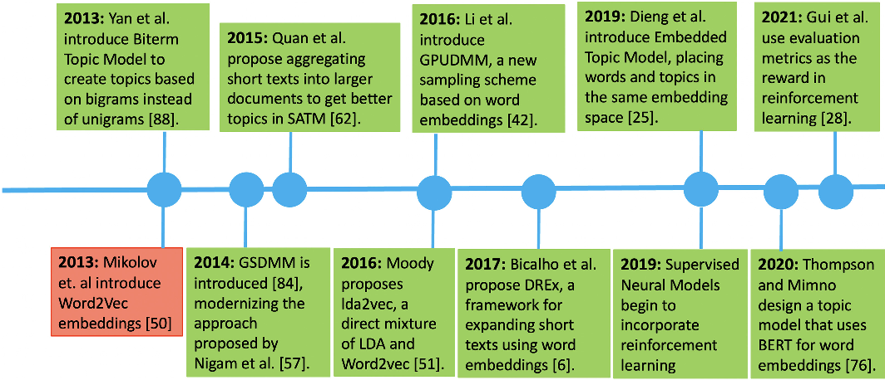
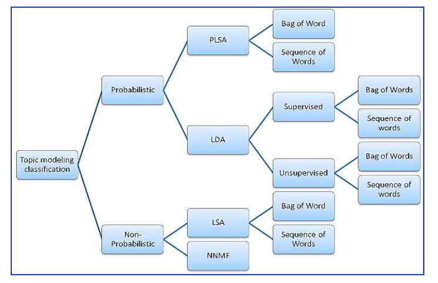
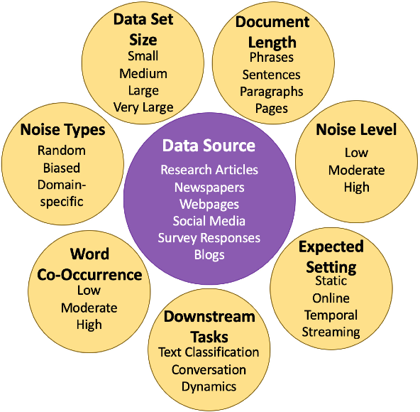
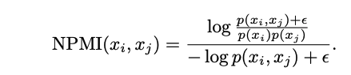
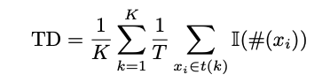

## Overview
For a general, high-level overview of the history of Topic modelling:  

## **Traditional Algorithms**

- **Latent Dirichlet Allocation (LDA):**
  - LDA is a probabilistic model that assumes each document is a mixture of topics, and each topic is a mixture of words. It remains one of the most widely used topic modeling techniques due to its effectiveness and simplicity.

- **Latent Semantic Analysis (LSA):**
  - LSA uses singular value decomposition to reduce the dimensionality of the document-term matrix, capturing patterns in word usage and relationships between documents.

- **Non-negative Matrix Factorization (NMF):**
  - NMF is a matrix factorization technique that decomposes the document-term matrix into non-negative factors, which can be interpreted as topics.

## Modern  approaches in Topic Modelling:

#### Overview by Churchill et. al. (2022): 
-  **1.Non-negativ Matrix-Factorization** 
-  **2. Graph-based Models**
    - Graph Neural Topic Model
    - Graph Topic Model
    - Graph2Topic
- **3. Combinations of TM + Modern NLP (2023)**
    - Biterm Topic Models
    - Self-aggregating Topic Models
    - Latent Feature LDA and Latent Feature DMM
    - Neural Variational Document Model
    - Ida2Vec
    - Pseudo-document-based Topic Model (PMT)
    - Embedding-based Topic Models
    - Gibbs Sampling DMM 
    - GPUDMM and DPUPDMM
    - Distributed Representation-based Expansion (DREx)
    - Common Semantics Topic Models (CSTM)
    - Word Embedding LDA
    - Laplacian DMM 
    - CluWords & CluHTM
    - Embedded Topic Model and Dynamic embedded Topic Model
    - Topic Modeling with BERT 
    - Topic Noise Models

- **4. Meta-data augmented, Supervised, and Reinforcement-Learning based Models**
    - Topic Tracking Model
    - Adversarial-neural Topic Model
    - Bidirectional Adversarial Topic Model

### An alternativ categorization  (Kherwa et. al. (2020)) 

### Selection Criterions:
According to [Churchill et. al. (2022)](https://www.researchgate.net/publication/357792535_The_Evolution_of_Topic_Modeling) model selection should take the following dimensions into consideration:   

´

#### General Learnings
Models that work well with short texts: 
- SATM
- ETM

Models that work well with noisy data: 
- TND
- NLDA
- PTM 
- CSTM
- WELDA

## Metrics to evaluate Models/Algorithms for Topic Modelling

#### 1. Topic Coherence
Topic coherence measures how semantically similar the words within a topic are. It is a crucial metric because it reflects how interpretable the topics are to humans. Common coherence metrics include: 
- **Adjusted Rank Index**:
- **Signal to noise Ratio:**
- **CV Coherence**:   Uses normalized pointwise mutual information (NPMI) and cosine similarity to evaluate coherence. However, it has been criticized and is not always recommended for use. 
- **UMass Coherence**:   Measures the co-occurrence of words within a topic based on a reference corpus. It is often preferred over CV coherence for its reliability. 
- **UCI Coherence**:   Similar to UMass but uses a sliding window approach over the corpus to calculate coherence.

#### 2. Perplexity
Perplexity is a statistical measure that evaluates how well a probability model predicts a sample. In topic modeling, it assesses how well the model predicts unseen documents. Lower perplexity indicates a better fit of the model to the data, but it does not necessarily correlate with human interpretability. 

#### 3. Reconstruction Error 
This metric is used primarily with models like Non-negative Matrix Factorization (NMF). It measures the difference between the original document-term matrix and the matrix reconstructed from the topic model. Lower reconstruction error indicates a better model fit.
#### 4. Rank Biased Overlap (RBO)
RBO is used to compare the similarity between ranked lists of words in topics. It is useful for comparing topics generated by different models or configurations. 

#### 5. Stability Metrics 
These metrics, such as Kendall's Weighted Tau, evaluate the stability of topics across different runs or datasets. Stability is important to ensure that the topics are not artifacts of random initialization or specific data samples. 
#### 6. Topic Diversity
Topic diversity assesses the variety of topics generated by the model. A diverse set of topics indicates a more comprehensive representation of the dataset. 
#### 7. Human Judgment
Despite the availability of quantitative metrics, human judgment remains an essential part of evaluating topic models. Human evaluators can assess the interpretability and relevance of topics, which is often not fully captured by automated metrics. 
#### 8. Probability of Held-out Documents 
This metric evaluates the generalization capability of a topic model by estimating the probability of unseen documents given the trained model. It provides insights into how well the model can predict new data.

### Pratical Application: 
[Wu et. al. (2024)]([10.21203/rs.3.rs-3049182/v1](http://dx.doi.org/10.21203/rs.3.rs-3049182/v1)) proposed a pratical set of metrics to evaluate model performance, consisting of the following metrics that can be calculated via [Palmetto](https://github.com/dice-group/Palmetto): 

#### 1. Perplexity:
It is measured as the normalized log-likelihood of held-out test documents. Perplexity has been used for years to evaluate topic models. However, previous studies have shown that perplexity inaccurately reflects the quality of discovered topics as it often contradicts human judgment (Chang et al, 2009). Besides, computing loglikelihood is inconsistent for different topic models because they apply various sampling or approximation techniques (Wallach et al, 2009; Buntine, 2009). This makes fair comparisons intractable. Due to these reasons, perplexity has become less popular for topic model evaluation.

#### 2. Topic Coherence:
Topic coherence measures the coherence between the most related words of topics, i.e., top words (determined by topic-word probabilities).
Experiments show that topic coherence can agree with the human evaluation on topic interpretability (Lau et al, 2014).

 For example, one widely-used coherence metric is Normalized Point-wise Mutual Information (NPMI, Bouma, 2009; Newman et al, 2010; Lau et al, 2014).

  

#### 3. Topic Diversity:

- **Topic Uniqueness**  
  Nan et al (2019) ) propose Topic Uniqueness (TU) which computes the average reciprocal of top word occurrences in topic.
  Given K topics and the top T word of each topic, TU is computed as
- 
  

- **Topic Redundance** 
   Burkhardt and Kramer (2019) propose Topic Redundancy (TR) that calculates the average occurrences of a top word in other topics. Its computation is:  
  
- **Topic Diversity:** 
  Dieng et al (2020) propose Topic Diversity (TD) which computes the proportion of unique top words of topics: 
  
  
  
   where I(·) is a indicator function that equals 1 if #(xi) = 1 and equals 0 otherwise. A higher TD score indicates more diverse topics

--- 
### Code:
Due to the limited scope, only a handful of models/algorithms have been tested and benchmarked.
Namely: 
- BERTopic
- PLSA (TDB)
- LDA
- LSA
- NNMF

The corresponding code can be found here: 
[Python Benchmarking Code for Traditional TM Approaches](code/traditional_TM.py)  
[Python Benchmarking Code for Neural TM Approaches](code/neural_TM.py)

### Toolset: 
- [BERTopic](https://github.com/MaartenGr/BERTopic) - Leveraging BERT and c-TF-IDF to create easily interpretable topics.
- [Gensim](https://github.com/piskvorky/gensim) - Python Library for topic modelling
- [Palmetto](https://github.com/dice-group/Palmetto)  Quality measuring python tool for topic (modelling)
