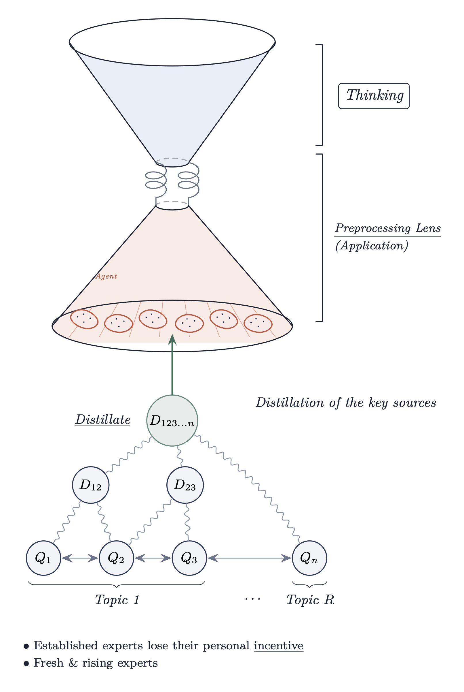

In my current limited understanding, living  with information comes down the following simple mode: 

which can be managed with the following process: 

So in my perception, tameing information comes down to: 

- Sources to pay attention to
- Destillation methods to work with
- Perceptive Issues to attach to 

- A dervivative procedure to derive knowledge from destilled information
