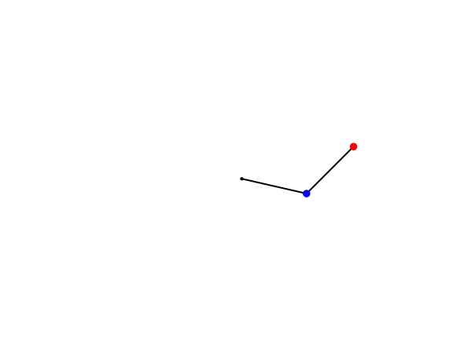

# Mathematical Systems: 
In the following, I am working with this definition of systems:

 > A system is a group of interacting or interrelated elements that act according to a set of rules to form a unified whole. It is characterized by its boundaries, structure, and purpose, and is influenced by its environment

To my understanding, in mathematics, systems can be roughly grouped in the following clusters: 
####  **Linear vs. Nonlinear Systems**:
- **Linear Systems**: Systems described by linear equations, where the principle of superposition applies. Solutions can be easily combined and scaled. 
- **Nonlinear Systems**: Systems described by nonlinear equations, where the principle of superposition does not apply. These systems can exhibit complex behaviors such as chaos and bifurcations.
#### **Static vs. Dynamic Systems**: 
- **Static Systems**: Systems where variables do not change over time. They are often described by algebraic equations. 
- **Dynamic Systems**: Systems where variables evolve over time, typically described by differential or difference equations. 
####  **Continuous vs. Discrete Systems**: 
- **Continuous Systems**: Systems where variables change continuously over time, often modeled using differential equations.
- **Discrete Systems**: Systems where variables change at discrete intervals, often modeled using difference equations or discrete-time models. 
####  **Deterministic vs. Stochastic Systems**: 
- **Deterministic Systems**: Systems with no randomness involved in the evolution of their state. The future behavior is fully determined by the initial conditions. 
- **Stochastic Systems**: Systems that incorporate randomness, often modeled using probabilistic methods and stochastic differential equations. 
#### **Time-Invariant vs. Time-Variant Systems**: 
- **Time-Invariant Systems**: Systems whose behavior and characteristics do not change over time. - **Time-Variant Systems**: Systems whose parameters or structure change over time. 
#### **Autonomous vs. Non-Autonomous Systems**: 
- **Autonomous Systems**: Systems where the rules governing the evolution do not explicitly depend on time. 
- **Non-Autonomous Systems**: Systems where the rules governing the evolution explicitly depend on time, often leading to time-dependent behavior.

# What is Chaos and where does it begin?
What happens when we know to little? At least in my world, too little information leads to unpredictability of the  dynamic systems around me, also defined as chaos: 

 
 > The original ancient Greek word chaos (χαος) refers to the shapeless primordial mass from which the earth (ancient Greek Gaia or Γαια) emerged. Today, we generally understand chaos to be a disorganised state that is difficult to predict; we speak of "traffic chaos", for example. While this image describes the interaction of many traffic participants, which in chaos theory correspond to many degrees of freedom, it has recently been shown that systems with few degrees of freedom, such as a periodically driven pendulum, can also exhibit chaotic time behaviour. This means that its angular position as a function of time becomes irregular and unpredictable in the long term (Fig. 1a). This type of chaos is called deterministic chaos.
 > - *Spektrum der Wissenschaft*

But where does predictability end and chaos begin? How little information is too little to predict systems? Modern chaos-theory offers at least some kind of structure to identify this point on which predictability comes to a (sudden) halt. For a system to become chaotic, commonly speaking the following criteria have to be met: 

1. **Sensitive Dependence on Initial Conditions**:  Even in deterministic systems, small differences in initial conditions can lead to vastly different outcomes. This phenomenon is often referred to as the "butterfly effect," where a minor change, such as the flap of a butterfly's wings, can ultimately cause a tornado elsewhere. This sensitivity makes long-term prediction impossible, even though the system is deterministic. 

2. **Complexity and Overfitting**:  In complex systems, adding more variables or increasing the complexity of models does not necessarily improve predictability. Instead, it can lead to overfitting, where a model becomes too tailored to past data and fails to predict future outcomes accurately.  

3. **Chaotic Dynamics**:   Systems that exhibit chaotic behavior are predictable only for short periods. The predictability diminishes as time progresses due to the exponential increase in uncertainty. This is characterized by the Lyapunov time, which defines how long a system remains predictable before becoming chaotic. 

4. **Intrinsic Unpredictability**:  Some systems are inherently unpredictable due to their chaotic nature. This unpredictability is not due to randomness but rather the complex interplay of deterministic laws that govern the system's dynamics.
   
5. **Measurement Limitations**:  The inability to measure initial conditions with perfect accuracy further contributes to unpredictability. Even minute measurement errors can lead to significant deviations in predictions over time. In summary, predictable systems become unpredictable when they exhibit chaotic behavior, sensitive dependence on initial conditions, and when complexity or measurement limitations prevent accurate long-term forecasting.

### Example I - Lorenz Attractor
The **Lorenz attractor** is a concept in chaos theory, originating from the Lorenz system, a set of three ordinary differential equations. These equations were first introduced by Edward Lorenz in the 1960s as a simplified mathematical model for atmospheric convection. The Lorenz attractor is a specific solution to these equations that exhibits chaotic behavior, which is highly sensitive to initial conditions—a phenomenon often referred to as the "butterfly effect."
##### Lorenz System 
The Lorenz system is defined by the following set of differential equations: $$ \begin{align*} \frac{dx}{dt} &= \sigma (y - x), \\ \frac{dy}{dt} &= x(\rho - z) - y, \\ \frac{dz}{dt} &= xy - \beta z, \end{align*} $$ where $\sigma$, $\rho$, and $\beta$ are parameters that can be adjusted to change the system's behavior. The system is typically studied with the parameters $\sigma = 10$, $\rho = 28$, and $\beta = 8/3$. 
##### Characteristics of the Lorenz Attractor 
- **Chaotic Behavior**: The Lorenz attractor is a classic example of a chaotic system. It demonstrates that even deterministic systems can produce unpredictable and seemingly random behavior over time. Small differences in initial conditions can lead to vastly different outcomes, illustrating the sensitive dependence on initial conditions. 
- **Strange Attractor**: The Lorenz attractor is classified as a "strange attractor," meaning it has a fractal structure and does not settle into a fixed point or a periodic orbit. Instead, it continuously evolves in a complex, non-repeating pattern.
- **Visual Representation**: When plotted in three-dimensional space, the Lorenz attractor forms a shape that resembles a butterfly or an owl's mask. This shape is iconic in chaos theory and is often used to illustrate the concept of the butterfly effect. 
##### Lorenz Attractor in Phase Space: 

### Example II - Double Pendelum

**Chaotic Phase Space of a double Pendelum**

 
 

**Simulation Code**
A Python Implementation can be found in this script: 
[Double Pendelum](../utils/chaos_code/double_pendelum.py)

#### Equations of Motion 
The equations of motion for the angles 
$\theta_1$ and $\theta_2$ are derived using the Lagrangian approach: $$ \begin{align*} \frac{d}{dt} \left( \frac{\partial L}{\partial \dot{\theta}_1} \right) - \frac{\partial L}{\partial \theta_1} &= 0, \\ \frac{d}{dt} \left( \frac{\partial L}{\partial \dot{\theta}_2} \right) - \frac{\partial L}{\partial \theta_2} &= 0. \end{align*} $$
These equations are complex and typically require numerical methods for solutions, such as the Runge-Kutta method. 
#### Cartesian Coordinates 
Given the angles $\theta_1(t)$ and $\theta_2(t$, the Cartesian coordinates of the masses are: 
- **First Mass ($m_1$):** $$ \begin{align*} x_1(t) &= L_1 \sin(\theta_1(t)), \\ y_1(t) &= -L_1 \cos(\theta_1(t)). \end{align*} $$ - **Second Mass ($m_2$):** $$ \begin{align*} x_2(t) &= x_1(t) + L_2 \sin(\theta_2(t)) = L_1 \sin(\theta_1(t)) + L_2 \sin(\theta_2(t)), \\ y_2(t) &= y_1(t) - L_2 \cos(\theta_2(t)) = -L_1 \cos(\theta_1(t)) - L_2 \cos(\theta_2(t)). \end{align*} $$
#### Initial Conditions 
The initial conditions for the pendulum are specified by the initial angles and angular velocities: $$ \begin{align*} \theta_1(0) &= \theta_{1,0}, \\ \theta_2(0) &= \theta_{2,0}, \\ \dot{\theta}_1(0) &= \omega_{1,0}, \\ \dot{\theta}_2(0) &= \omega_{2,0}. \end{align*} $$ 
## Am I chaotic? 
Following approaches can be used to identify the chaotic extent of a dynamic systems: 
### 1. Lyapunov Exponents: 
**Description**:
The most widely used method involves calculating the largest Lyapunov exponent. A positive largest Lyapunov exponent indicates that the system is chaotic, as it signifies exponential divergence of nearby trajectories. 
**Application**: 
This method is applicable to systems where the equations are known, and it can be estimated for experimental data using embedding techniques. 

### 2. 0-1 Test for Chaos: 
**Description**: 
This test provides a binary output (0 for non-chaotic, 1 for chaotic) based on time series data. It does not require phase space reconstruction and is applicable to a wide range of deterministic systems.  
**Advantages**: 
It is straightforward to apply and does not depend on the dimensionality of the system. 
 
### 3. Permutation Entropy: 
**Description**: Used in the Chaos Decision Tree Algorithm, permutation entropy is a measure that correlates with the largest Lyapunov exponent and can track the degree of chaos in a system.   
**Use Case**: Effective for systems where direct calculation of Lyapunov exponents is challenging due to noise or finite data. 
### 4. Poincaré Surface of Section and Phase Space Analysis: 
 **Description**: Visualizing the system's trajectory in phase space can help identify chaotic behavior. Chaotic systems often exhibit complex, fractal-like structures known as strange attractors.  
 **Tools**: Techniques like the Poincaré Surface of Section and phase space slicing are used to visualize these dynamics. 

### 5.  Frequency Map Analysis and Recurrence Plots: 
**Description**: These methods analyze the frequency components and recurrence of states in the system to detect chaos.  
**Application**: Useful for both theoretical and experimental data, providing insights into the system's regularity or chaotic nature.

# What to do under chaos? 
Run
