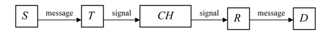

# Working definition of Information
What is information? For this question, many different concepts and theories exist. I'll try to create a helpful overview by listing various well established definitions before defining a working definition in this project.

### 1. Oxford Dictionary
According to the Oxford dictionary, Information can be defined as "*facts or details about somebody/something*", with leads to the need of defining what a "Fact" or "Detail" as well as what "something" entails.
In order to get  going, some working definitions have to be made here.

* **Facts** 
Objectively, physically perceivable, constitutions of the senseable surroundings that let humans for theories about the 
characteristics of there surroundings (in order to give them orientation and guide their actions), that have not (yet) been falsified.

* **Approx. in Scientific Context**: 
Theory that has been design by following well established scientific principles and not falsified, despite being theoretically falsifiable.

* **Something**  
Objectively physically perceivable entity to which facts can be attributed to.

### 2. Different perspectives:
Information is a classic polysemantic word, where it's semantic meaning is largely dependent the given perspective. 
Hence I want to list the, to my understanding, most common perspectives on Information:
* **Philosophical Perspective:** <bf>
Strongly related with notions such as reference, meaning and representation: semantic information has
intentionality −“aboutness”−, it is directed to other things

* **Scientific Perspective**:  
Problems are expressed in terms of a notion of information amenable to
quantification
* **Mathematical Persepective**:
  
    * **Fisher Information:** 
      Measures the dependence of a random variable X on an unknown parameter θ upon which
the probability of X depends
    
    * **Algorithmic information**:  
      Measures the length of the shortest program that produces a string on a universal [Turing machine](../turing_machines/notes_turing). 
    
    * **von Neumann Entropy** 
      Gives a measure of the quantum resources necessary to faithfully encode the state of the source-system;
        
    * **Shannon Entropy**:  is concerned with the statistical
properties of a given system and the correlations between the states of two systems,
independently of the meaning and any semantic content of those states. Nowadays, Shannon’s
theory is a basic ingredient of the communication engineers training. 

### 3. Shannon's Communication/Information Theory
According to Shannon (1948; see also Shannon and Weaver 1949), a general
communication system consists of five parts:

* A source S, which generates the message to be received at the destination.

* A transmitter T, which turns the message generated at the source into a signal to be transmitted.
In the cases in which the information is encoded, encoding is also implemented by this system.

* A channel CH, that is, the medium used to transmit the signal from the transmitter to the
receiver.
* A receiver R, which reconstructs the message from the signal.
* A destination D, which receives the message. 
  
 

#### Central Definitions: 
**Information as a Decrease in Uncertainty**
Information is defined as a decrease in uncertainty. For example, if Bob is trying to guess which shape Alice is holding, and Alice tells him it is blue, this reduces the set of possible shapes, thereby decreasing Bob's uncertainty.

**Entropy**
Entropy quantifies the amount of uncertainty involved in the value of a random variable or the outcome of a random process. It is measured by the formula

$$\[H(X) := -\sum_{x \in X} p(x) \log p(x)\]$$

 
where $\( X \)$ is the set of possible values of $\( X \)$ and $\( p(x) \)$ is the probability of $\( x \)$.

To quote from [Maxwell and his deamon](https://www.ias.ac.in/public/Volumes/reso/015/06/0548-0560.pdf):

> Moral. The 2nd law of thermodynamics has the same degree of truth as the statement that if you throw a tumberflu of water into the sea, you cannot ge tthe same tumblerflu of water out again

which led to physicists speaking about micro- and macrostates where entropy became a physical equivalent of probabilty: The entropy of a given macro state is the logarithm of the number of possbiel micro-states.

More on that can be found here: [Maxwells Daemon](https://www.spektrum.de/lexikon/physik/maxwellscher-daemon/9530)

**Binary Digits (Bits)**
Shannon introduced the concept of binary digits, or bits, as the fundamental unit of information. A bit is a binary digit that can take on one of two values, typically 0 or 1. This concept revolutionized the way information was quantified and transmitted.

Leading to:

### 4. Norbert Wiener - Cybernetics
Wiener coined the term "cybernetics" to refer to the study of self-regulating mechanisms, whether in machines or living organisms.
- The book explored the mathematical principles underlying feedback, communication, and control in both technological and biological systems. It drew connections between concepts like information, communication, and thermodynamics.
- Cybernetics discussed the parallels between information processing in computers and the human brain, and speculated about the possibility of building chess-playing computers, hence building thoses black boxes that behaviorists at that time could not demistify.
  

# Representation of Information
## How can Information be represented? 
Many different forms, in this project, I limit the forms of information representations to:
- Set of Symbols (or corresponding sounds) $\Rightarrow$ will be abstracted as representations of Symbols (Letters), Words and Sentences.
- Images $\Rightarrow$ will be abstracted as a collection of pixels

Those two different representing our case, via bits and bytes, as they form the fundament of modern computers. 

### Neuro-scientific representation
TDB

## What is it's minimal/essential structure? 
### Symbolic Encoding
**Assumption**: Every letter, and hence every text  can be encoded as a number (Example: ASCII).
 With Standard ASCII, every Letter corresponds to 7 Bit. Trough removal of redundancy, for example via the [Shannon-Fano compression](../utils/shannon_fano_coding.py), this number can be reduced slightly further, but nonetheless still more or less stupidly stores every letter explicitly
and defines Information as a concatenation of symbols (letters).

### Sub-Symbolic Encodings
#### Word Embeddings
* 1-Word-1Vector:
  * Word2Vec (Skip-Gram & CBOW)
  * Glove
  * A lot of specialized variants of the two
* 1-Word-1-Vector+Char-n-grams 
  * FastText(based on Word2Vec)
* Contextualized / context dependent / complex structure (char or word piece based) 
  *   ELMo
  * Transformers a la [BERT](../Embeddings/Bert.md) and its variants

